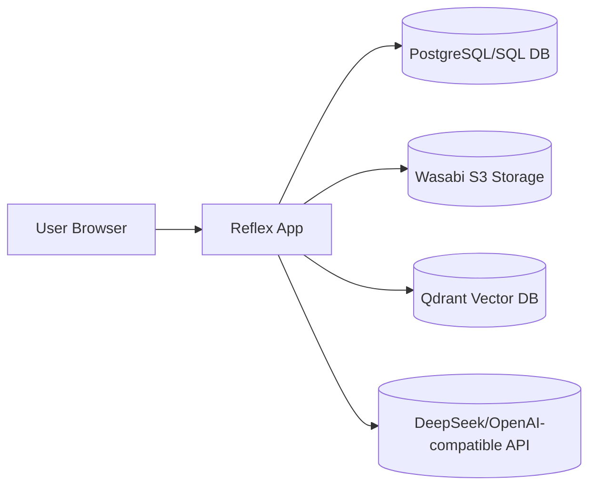
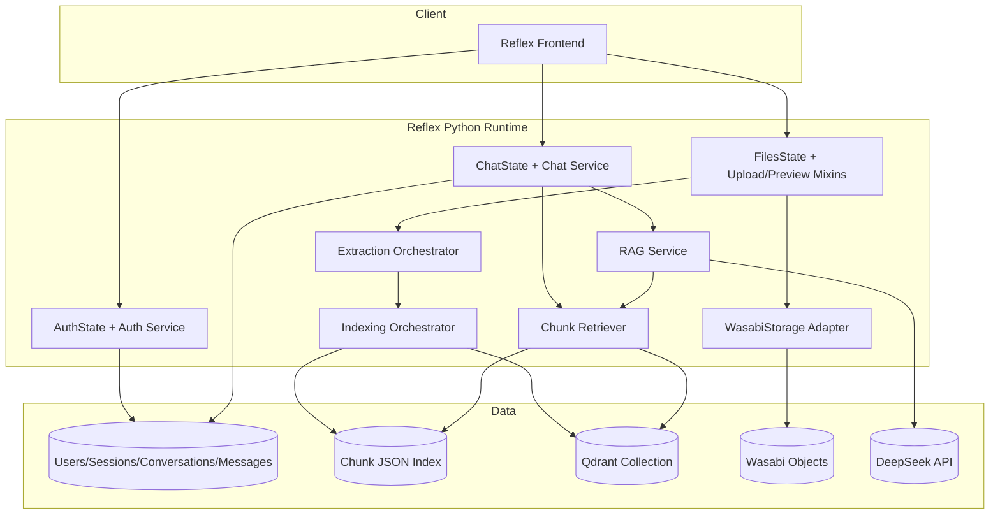
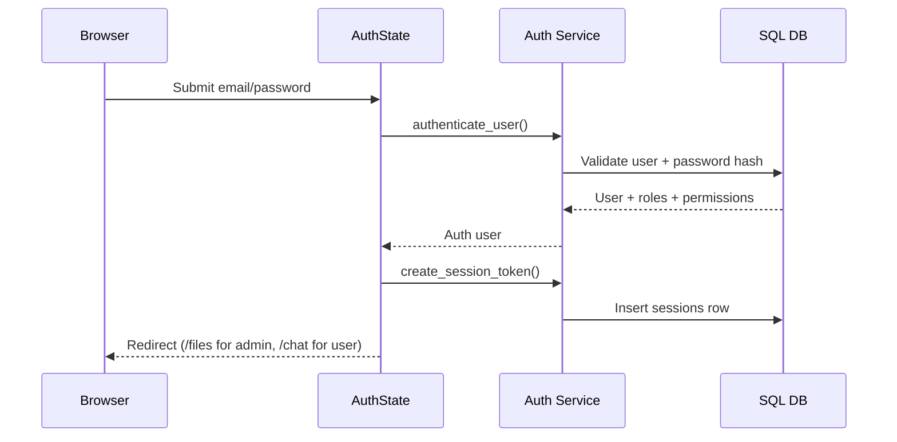
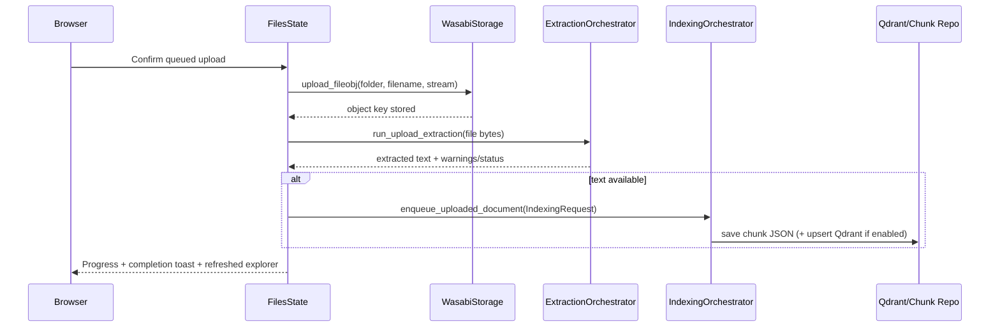
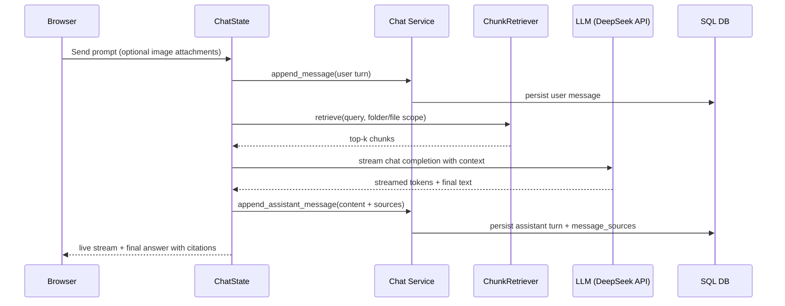

# Receipt AI Architecture Documentation

## 1) Executive Overview

`receipt_ai` is a Reflex-based web application for receipt-centric document management and RAG-assisted chat.

At a high level, the platform combines:
- **UI + State orchestration** via Reflex pages/components and `rx.State` feature states
- **Identity and chat persistence** in SQL database tables managed with Alembic
- **Object storage** in Wasabi (S3-compatible) for uploaded files
- **Extraction and indexing pipeline** to convert uploads into searchable chunks
- **Retrieval + LLM generation** using chunk search plus DeepSeek-compatible chat completion APIs

The design follows a practical modular-monolith pattern: clear feature boundaries (`auth`, `files`, `chat`, `extraction`) inside one deployable app.

---

## 2) Architecture Goals and Quality Attributes

- **Traceable answers**: assistant responses carry source metadata (`message_sources`) to support explainability.
- **Role-aware access**: route guards and capability checks enforce role/permission boundaries.
- **Resilient user experience**: upload/extraction/indexing and chat streaming expose progress and recoverable errors.
- **Composable retrieval stack**: supports local JSON chunk index fallback and Qdrant-backed semantic search.
- **Operational simplicity**: modular codebase without microservice overhead; externalized storage/vector/LLM dependencies.

---

## 3) System Context

Core code entry:
- App factory and routes: `receipt_ai/app.py`
- Feature states: `receipt_ai/features/*/state.py`
- Data model: `receipt_ai/core/db/models.py`

---

## 4) Codebase Architecture (Layered by Feature)

## 4.1 Presentation Layer (Reflex)

- `receipt_ai/pages/`: route-level page composition (`/login`, `/files`, `/chat`)
- `receipt_ai/components/`: reusable UI units
- `receipt_ai/core/theme/`: global style shell/tokens/a11y helpers

UI behavior is state-driven: components bind to `rx.State` fields and events.

## 4.2 State/Application Layer

- `AuthState`: authentication, session guard, role/permission computation
- `FilesState`: file explorer state, upload workflows, preview state, CRUD commands
- `ChatState`: thread/message UX, streaming, citations, feedback, retry/edit actions

State classes orchestrate interactions among services and emit UI events (`toast`, redirects, script callbacks).

## 4.3 Domain + Service Layer

- `features/auth/service.py`: credential/session validation against DB
- `features/chat/service.py`: conversation/message persistence and feedback/source handling
- `features/extraction/*`: extraction adapters, router, validation, post-processing
- `features/extraction/indexing/*`: chunk generation, embeddings, index status and persistence
- `features/extraction/retrieval/*`: retrieval abstraction from local index or Qdrant
- `features/storage/wasabi/service.py`: S3-compatible object operations

## 4.4 Data/Infrastructure Layer

- SQLAlchemy ORM models in `core/db/models.py`
- Async DB sessions in `core/db/session.py`
- Alembic migrations in `alembic/versions/`
- External infra:
  - Wasabi bucket
  - Optional Qdrant
  - DeepSeek-compatible model endpoint

---

## 5) Runtime Component Diagram

---

## 6) Persistent Data Model

Primary relational entities (`core/db/models.py`):
- `users`: identity and profile
- `sessions`: session tokens with expiry
- `roles`, `permissions`, `user_roles`, `role_permissions`: RBAC
- `conversations`: user-owned thread metadata
- `messages`: user/assistant turns
- `message_sources`: citation references (file key/chunk index/score)
- `message_feedback`: per-user vote for assistant messages

Ownership and access model:
- Conversations and messages are user-scoped.
- Feedback and source lookups are guarded by conversation ownership joins.
- Route guards (`guard_admin_route`, `guard_protected_route`) enforce page access.

---

## 7) End-to-End Data Flow

## 7.1 Authentication and Route Access

## 7.2 Upload -> Extraction -> Indexing Pipeline

## 7.3 Chat Query with Retrieval-Augmented Generation

## 7.4 Chat Attachment Context Flow

- Chat attachments are validated for allowed image types.
- Each image goes through extraction (`run_upload_extraction`) with receipt-quality checks.
- Extracted text is appended into prompt context as an "attached image extraction context" block.
- Non-receipt images can be rejected with a user-facing fallback response.

---

## 8) Retrieval and Indexing Strategy

- **Dual retrieval backend**
  - If `QDRANT_URL` is configured: semantic search via Qdrant (`similarity_search_with_score`).
  - Otherwise: local JSON chunk embeddings + cosine similarity ranking.

- **Scoped retrieval**
  - Chat can pass folder-level or exact-file filters from active Files context.
  - This reduces irrelevant context and improves citation quality.

- **Chunk provenance**
  - Chunk metadata includes folder, file key, chunk index, type, and upload/index timestamps.
  - Returned hits are transformed into source objects rendered in chat and persisted in DB.

---

## 9) Security and Access Control

- Session token lifecycle:
  - issued on login
  - validated on guarded routes
  - revocable on logout
- RBAC checks are centralized in `AuthState.has_permission()` and role guards.
- Files upload operations require `files:write`.
- Chat image upload requires `chat:image_upload`.
- Source-opening actions verify message ownership before exposing presigned URLs.

---

## 10) Reliability, Error Handling, and Observability

- Extraction/indexing/chat operations wrap failures and return actionable messages.
- Index status (`processing`, `completed`, `failed`) is tracked and reflected in Files UI.
- Upload flow reports staged progress (`uploading`, `extracting`, `indexing`, `finalizing`).
- Backward-compatible handling exists for DB schema drift (e.g., feedback table not yet migrated).

Recommended observability improvements:
- Structured request correlation IDs from upload -> extraction -> indexing -> chat retrieval.
- Centralized metrics (success/error rates, latency per stage, empty-retrieval rate).
- Alerting on external dependency failures (Wasabi/Qdrant/LLM).

---

## 11) Architectural Risks and Mitigations

- **Risk: Tight coupling of long-running tasks to request/state loop**
  - Mitigation: move extraction/indexing to durable background workers/queue.

- **Risk: External service availability impacts UX**
  - Mitigation: health checks + graceful fallbacks + dependency status banner.

- **Risk: Storage/index consistency gaps on partial failures**
  - Mitigation: idempotent retry policies and compensating actions per file key.

- **Risk: Growing state class complexity**
  - Mitigation: continue extracting use-case services and keep `State` as orchestration layer only.

---

## 12) Senior-Level Roadmap (Plan After Analysis)

## Phase A: Architecture Baseline (1-2 days)
- Freeze and version this architecture document as baseline.
- Define source-of-truth diagrams for demo, onboarding, and reviews.
- Add environment matrix for local/dev/prod dependency settings.

## Phase B: Operational Hardening (3-5 days)
- Introduce centralized logging context across auth/upload/chat pipelines.
- Add retry and timeout policy standards for Wasabi/Qdrant/LLM calls.
- Add dependency health endpoint and startup readiness checks.

## Phase C: Data and Retrieval Quality (3-5 days)
- Add retrieval quality metrics (hit quality, citation usage, no-context rate).
- Implement chunk deduplication and optional reranking.
- Add index reconciliation job for object-store/index drift.

## Phase D: Scalability and Separation (1-2 weeks)
- Move extraction/indexing into worker queue (RQ/Celery/Arq equivalent).
- Keep Reflex app focused on user interaction and orchestration.
- Establish interface contracts for chat/retrieval/indexing boundaries.

## Phase E: Governance and DX (ongoing)
- Add architecture decision records (ADRs) for major changes.
- Expand integration tests for login -> upload -> index -> ask -> citation verification.
- Add runbooks for incident response (Qdrant down, Wasabi failure, LLM timeout).

---

## 13) Quick Navigation (Key Files)

- App composition: `receipt_ai/app.py`
- Auth orchestration: `receipt_ai/features/auth/state.py`
- Files orchestration: `receipt_ai/features/files/state.py`
- Upload pipeline: `receipt_ai/features/files/state_actions_upload.py`
- Extraction orchestrator: `receipt_ai/features/extraction/orchestrator.py`
- Indexing orchestrator: `receipt_ai/features/extraction/indexing/indexing_orchestrator.py`
- Retrieval logic: `receipt_ai/features/extraction/retrieval/retriever.py`
- RAG logic: `receipt_ai/features/chat/rag_service.py`
- Chat persistence: `receipt_ai/features/chat/service.py`
- SQL models: `receipt_ai/core/db/models.py`
